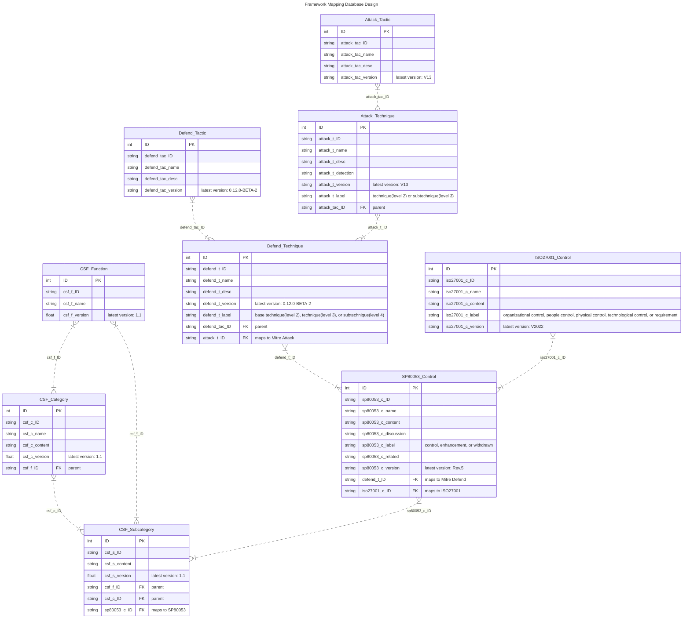

```mermaid
---
title: Framework Mapping Database Design
---

%%{init: {
  "theme": "default",
  "themeCSS": [
    ".er.relationshipLabel { fill: black; }", 
    ".er.relationshipLabelBox { fill: white; }", 
    ".er.entityBox { fill: #ACE1AF; }",
    "[id^=entity-CSF] .er.entityBox { fill: pink;} ",
    "[id^=entity-Attack] .er.entityBox { fill: #B9D9EB;} ",
    "[id^=entity-Defend] .er.entityBox { fill: #E6E6FA;} ",
    "[id^=entity-ISO] .er.entityBox { fill: orange;} "
    ]
}}%%

erDiagram
    CSF_Function }|..|{ CSF_Category : csf_f_ID
    CSF_Category }|..|{ CSF_Subcategory : csf_c_ID
    CSF_Function }|..|{ CSF_Subcategory : csf_f_ID
    SP80053_Control }|..|{ CSF_Subcategory : sp80053_c_ID
    Defend_Technique }|..|{ SP80053_Control : defend_t_ID
    Defend_Tactic }|..|{ Defend_Technique : defend_tac_ID
    Attack_Technique }|..|{ Defend_Technique : attack_t_ID
    Attack_Tactic }|..|{ Attack_Technique : attack_tac_ID
    ISO27001_Control }|..|{ SP80053_Control : iso27001_c_ID
  
   
    CSF_Function {
        int ID PK
        string csf_f_ID
        string csf_f_name
        float csf_f_version "latest version: 1.1"
    }

    CSF_Category {
        int ID PK
        string csf_c_ID
        string csf_c_name
        string csf_c_content
        float csf_c_version "latest version: 1.1"
        string csf_f_ID FK "parent"
    }

    CSF_Subcategory {
        int ID PK
        string csf_s_ID
        string csf_s_content
        float csf_s_version "latest version: 1.1"
        string csf_f_ID FK "parent"
        string csf_c_ID FK "parent"
        string sp80053_c_ID FK "maps to SP80053"
    }

    SP80053_Control {
        int ID PK
        string sp80053_c_ID
        string sp80053_c_name
        string sp80053_c_content
				string sp80053_c_discussion
				string sp80053_c_label "control, enhancement, or withdrawn"
        string sp80053_c_related
        string sp80053_c_version "latest version: Rev.5"
        string defend_t_ID FK "maps to Mitre Defend"
        string iso27001_c_ID FK "maps to ISO27001"
    }

    Attack_Tactic {
        int ID PK
        string attack_tac_ID
        string attack_tac_name
        string attack_tac_desc
        string attack_tac_version "latest version: V13"
    }

    Attack_Technique {
        int ID PK
        string attack_t_ID
        string attack_t_name
        string attack_t_desc
				string attack_t_detection
        string attack_t_version "latest version: V13"
				string attack_t_label "technique(level 2) or subtechnique(level 3)"
        string attack_tac_ID FK "parent"
        
    }

    Defend_Tactic {
        int ID PK
        string defend_tac_ID
        string defend_tac_name
        string defend_tac_desc
        string defend_tac_version "latest version: 0.12.0-BETA-2"
    }

    Defend_Technique {
        int ID PK
        string defend_t_ID
        string defend_t_name
        string defend_t_desc
        string defend_t_version "latest version: 0.12.0-BETA-2"
				string defend_t_label "base technique(level 2), technique(level 3), or subtechnique(level 4)"
        string defend_tac_ID FK "parent"
        string attack_t_ID FK "maps to Mitre Attack"
    }

    ISO27001_Control {
        int ID PK
        string iso27001_c_ID
        string iso27001_c_name
        string iso27001_c_content
				string iso27001_c_label "organizational control, people control, physical control, technological control, or requirement"
        string iso27001_c_version "latest version: V2022"
    }
```